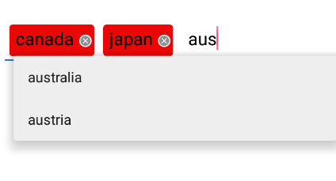

[](https://android-arsenal.com/details/1/3942)
<br>

ChipLayout
==========

ChipLayout is an opensource Android library. ChipLayout is an layout which create chips from the text you type and also allow you to show drop down(like MultiautocompleteTextView)

Add ChipLayout to your project
------------------------------
[](https://jitpack.io/#AmaldevTA/ChipLayout)

### Gradle
```
	allprojects {
		repositories {
			...
			maven { url 'https://jitpack.io' }
		}
	}
```

```
	dependencies {
	        implementation 'com.github.AmaldevTA:ChipLayout:1.1.0'
	}
```

OR

Module dependency - <br>Download folder 'AndroidChipLayout' and add as module dependency

Example
-------

### Screenshots

<br>


Source code with examples is included in repository.

Usage
-----
```xml
<LinearLayout xmlns:android="http://schemas.android.com/apk/res/android"
    xmlns:custom="http://schemas.android.com/apk/res-auto"
    android:layout_width="match_parent"
    android:layout_height="match_parent"
    android:background="#FFF"
    android:padding="10dp"
    android:orientation="vertical">
    <com.libaml.android.view.chip.ChipLayout
        android:id="@+id/chipText"
        android:layout_width="match_parent"
        android:layout_height="wrap_content"
        custom:textSize_="10dp"
        custom:chipPadding_="4dp"
        custom:chipTextPadding_="2dp"
        custom:textColor_="@android:color/black"
        custom:deleteIcon_="@android:drawable/presence_offline"
        custom:chipDrawable_="@drawable/round_corner_drawable"
        custom:chipLayoutDrawable_="@drawable/edittext_theme_landing_page"
        custom:labelPosition_="left">
    </com.libaml.android.view.chip.ChipLayout>
</LinearLayout>

```
======
Find the View in your Activity or Fragment class.

```java
  ChipLayout chip = (ChipLayout) findViewById(R.id.chipText);
        
        String[] countries = {"india","australia","austria","indonesia","canada"};
        ArrayAdapter<String> adapter = new ArrayAdapter<String>(this,android.R.layout.simple_list_item_1,countries);
        chip.setAdapter(adapter);

        chip.setOnClickListener(ClickListener);
        chip.setOnItemClickListener(ItemClickListener);
        chip.addLayoutTextChangedListener(TextChangedListener);
        chip.setOnFocusChangeListener(FocusChangeListener);
```

XML attributes 

 	        textSize_  		    	format=  dimension  
            chipPadding_   		    format=  dimension  
            chipPaddingLeft_   		format=  dimension  
            chipPaddingRight_  		format=  dimension  
            chipPaddingTop_   		format=  dimension  
            chipPaddingBottom_  	format=  dimension  
            chipTextPadding_   		format=  dimension  
            chipTextPaddingLeft_   	format=  dimension  
            chipTextPaddingRight_  	format=  dimension  
            chipTextPaddingTop_   	format=  dimension  
            chipTextPaddingBottom_  format=  dimension  
            textColor_      		format=  color   
            hintColor_      		format=  color
            chipColor_   		    format=  color
            showText_   	    	format=  boolean   
            showDeleteButton_   	format=  boolean   
            deleteIcon_   	    	format=  reference   
            chipDrawable_   		format=  reference   
            chipLayoutDrawable_   	format=  reference   
            labelPosition_   		format=  (left/right)
            hint_                   format=  string
            threshold_              format=  integer

Public Fields
```java
            static int MAX_CHARACTER_COUNT
```
          
Public Methods
```java
            public void setOnClickListener(OnClickListener l)
            public void setOnItemClickListener(AdapterView.OnItemClickListener l) 
            public void addLayoutTextChangedListener(TextWatcher textWatcher)
            public void removeLayoutTextChangedListener(TextWatcher textWatcher)
            public void setOnChipItemChangeListener(ChipItemChangeListener l)
            public void removeChipAt(int pos)
            public void removeAllChips()
            public void setAdapter(ArrayAdapter adapter)
            public void setText(List<String> vals)
            public void setTextColor(int textColor)
            public void setChipColor(int bgColor)

            public AdapterView.OnItemClickListener getOnItemClickListener()
            public ChipItemChangeListener getOnChipItemChangeListener()
            public int getTextColor()
            public int getChipColor()
            public List<String> getText()
            public ArrayAdapter getAdapter()
            
            public void highlightChipAt(int pos, Drawable bgDrawable, int textColor)
            public void highlightChipAt(int pos, int bgColor, int textColor)
```
